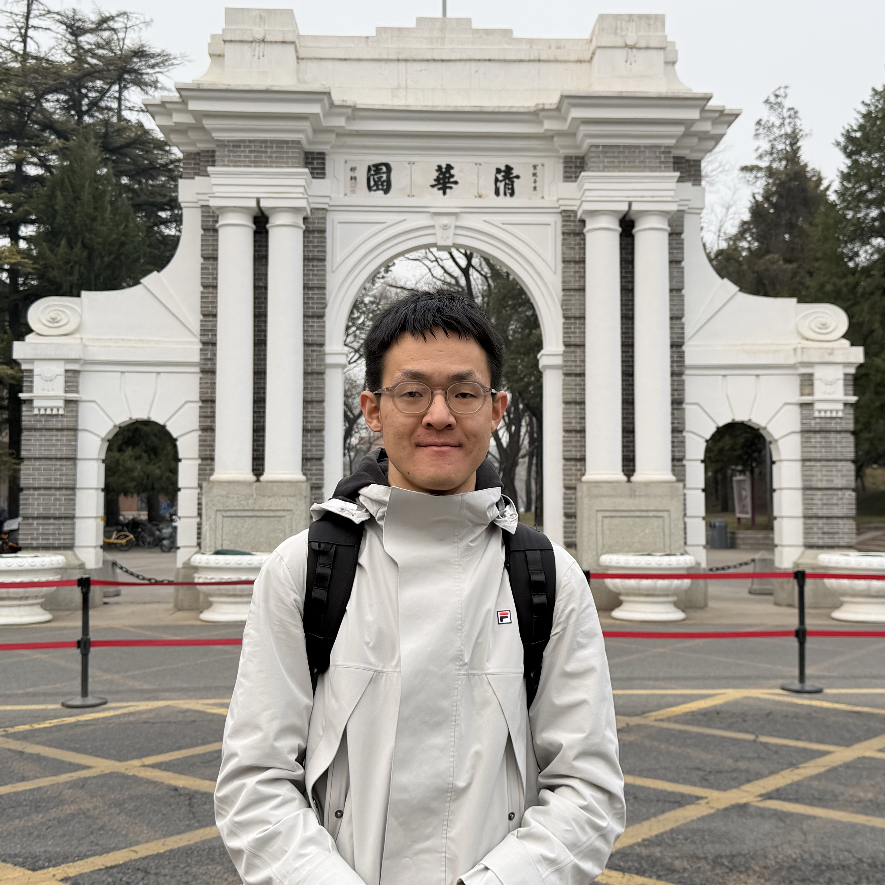

{: .profile-photo }

# 宋柏君 {#top}

**多模态生成 · 世界模型 · 表征学习**

[19350669024](tel:+8619350669024) · [b.song.echo@gmail.com](mailto:b.song.echo@gmail.com) · [GitHub](https://github.com/b-song-echo){:target="_blank" rel="noopener noreferrer"} · [Google Scholar](https://scholar.google.com/citations?hl=en&user=azqxpKgAAAAJ){:target="_blank" rel="noopener noreferrer"}

专注于多模态生成、世界模型、表征学习，具备从问题定义到模型设计再到大规模训练与评测的完整实践经验。

---

[教育](#education) · [实习](#internship) · [论文](#publications) · [技能](#skills)
{: .section-nav }

## 教育 {#education}

**清华大学**｜电子信息｜硕士｜袁春教授指导  
2024.09 – 2027.06

**大连理工大学**｜力学｜本科  
2020.09 – 2024.06

## 实习 {#internship}

**美团**｜多模态算法科研实习生（校企合作）｜点评·智能创作团队  
2025.07 – 至今  
获评**美团优秀科研实习生**

### WorldRoll：World Model Data & Post-Training

*第一作者，AAAI 2027 Under Review｜2025.08 – 2026.07*

- **独立设计并实现**面向 I2V 世界模型的数据 pipeline，将相机位姿/轨迹等信号转化为仅依赖**首帧 + 自然语言**的 world rollout 数据，使模型在训练或推理阶段可仅通过自然语言实现精确的相机控制。
- 构建**三源数据 pipeline**：融合带相机位姿真实视频、场景动态真实视频、教师世界模型（**HY-WorldPlay**）生成数据；完成基于 VLM（**Qwen3.6-27B**）的标注与筛选，得到 **60K 高质量训练视频**。使用 **vLLM** 进行多模态请求处理与推理流程。
- 对 **LTX-Video-2B** 与 **CogVideoX-Fun-2B** 在该数据集上进行 LoRA 微调后，两者在 **WorldScore Static 提升 8.1% / 8.8%，Dynamic 提升 5.5% / 5.9%，WorldModelBench 提升 5.2% / 4.9%**；完成 data composition、data/training scaling 等实验。
- **大规模训练与推理工程：** 实操 **HunyuanVideo（8B）** 在 **241 帧 720p** 视频上的多机训练（**2 × 8 A100**），使用 **FSDP + USP（Ulysses + RingAttention）+ Gradient Checkpointing**；
- **业务落地：** 正进一步面向**大众点评商家场景**构建垂域数据。用户上传门店照片，选择预设的 prompt，模型生成一小段视频。

### RibbonTok：Visual Tokenization for AR Generation

*第一作者，AAAI 2027 Under Review｜2025.08 – 2026.07*

- **独立设计并实现**面向自回归图像生成的多分辨率、单流、可变长度 tokenizer，将图像编码为 **coarse-to-fine 的 1D causal token sequence**，其任意前缀序列均可独立解码并重建为多物理分辨率图像。
- 提出并实现模型结构：**causal masked-register ViT + stacked directional codebooks + flow DiT**；提出并实现全新训练约束 **coalesce matching**，显式约束跨分辨率视图的前缀表征，使逻辑图像表征与物理输出分辨率解耦。
- 训练三种规模（300M、1B、2.5B）的 tokenizer，后者在 ImageNet 重建取得 **rFID 1.04 / PSNR 19.36 / SSIM 0.582**；完成模块消融、code utilization 等实验。
- 训练两种规模（1B、3B）的 Llama-style 自回归生成模型，后者仅生成 **32 tokens** 即达到 **gFID 1.43 / IS 348.8**，超越同规模模型（如 LlamaGen-3B）的同时实现 **>2× 端到端加速**。

## 论文 {#publications}

1. [**WorldRoll: From Privileged Camera Trajectories to Pose-Free World Rollouts**](assets/WorldRoll_main.pdf){:target="_blank" rel="noopener noreferrer"}  
   **第一作者**，AAAI 2027 Under Review｜[论文 PDF](assets/WorldRoll_main.pdf){:target="_blank" rel="noopener noreferrer"} · [补充材料 PDF](assets/WorldRoll_supp.pdf){:target="_blank" rel="noopener noreferrer"}

2. [**RibbonTok: Multi-Resolution, Single-Stream, and Adaptive-Length Tokenization for Autoregressive Image Generation**](assets/RibbonTok_main.pdf){:target="_blank" rel="noopener noreferrer"}  
   **第一作者**，AAAI 2027 Under Review｜[论文 PDF](assets/RibbonTok_main.pdf){:target="_blank" rel="noopener noreferrer"} · [补充材料 PDF](assets/RibbonTok_supp.pdf){:target="_blank" rel="noopener noreferrer"}

3. [**M3Time: LLM-Enhanced Multi-Modal, Multi-Scale, and Multi-Frequency Multivariate Time Series Forecasting**](assets/M3Time.pdf){:target="_blank" rel="noopener noreferrer"}  
   **共同第一作者**，AAAI 2026 Poster｜[论文 PDF](assets/M3Time.pdf){:target="_blank" rel="noopener noreferrer"}

## 技能 {#skills}

- **技术：** **Python、C++、PyTorch**；熟悉 **Transformers、Diffusers**；了解 **Triton、CUDA、Metal**。
- **英语：** **TOEFL 106**（L30 / R29 / S24 / W23），CET-6 624，CET-4 647。
- **获奖：**

[返回顶部](#top)
{: .back-to-top }
